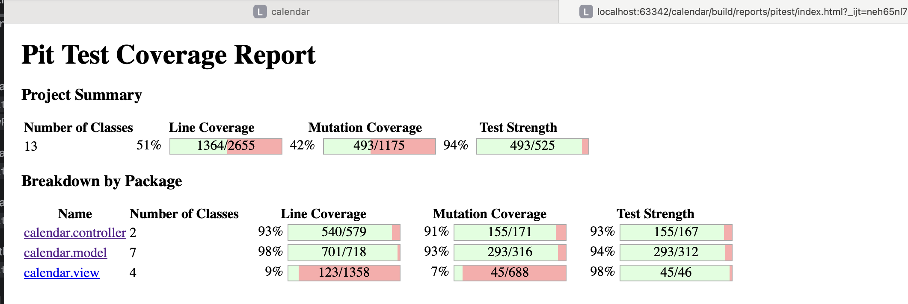

# Changes

* Model
* Controller
* View
* Tests
* Questionnaire.txt
* Coverage Report
* UML diagram

## Model Level

1. EventImpl: setStart() (line 167)

   Before:

   ```Java
   @Override
   public void setStart(LocalDateTime start, ZoneId zoneId) {
     start = EventBuilder.convertLocalToUniversalCoordinatedTime(start, zoneId);
     if (start.isAfter(getEndLocal(zoneId))) {
       throw new IllegalArgumentException("New start time can not be later than existing end time");
     }
     this.startTime = start;
   }
   ```

   After:

   ```Java
   @Override
   public void setStart(LocalDateTime start, ZoneId zoneId) {
     start = EventBuilder.convertLocalToUniversalCoordinatedTime(start, zoneId);
     if (start.isAfter(endTime)) {
       throw new IllegalArgumentException("New start time can not be later than existing end time");
     }
     this.startTime = start;
   }
   ```

2. Removed method isEquals isAfter, and isBefore in EventImpl and Event interface.

   ```Java
   boolean isEqual(ChronoLocalDateTime<?> other);
   ```

   ```Java
   boolean isAfter(ChronoLocalDateTime<?> other);
   ```

   ```Java
   boolean isBefore(ChronoLocalDateTime<?> other);
   ```

3. Removed method removeAll in EventSeries interface and EventSeriesImpl

   ```Java
   /**
    * Remove all the events in a series.
    */
   void removeAll();
   ```

   

4. EventLinkedListImpl: 376

   Modified updateProperty() method.  This method now supports editing event series to a different day.

```java
private void updateProperty(EventSeries eventSeries, Property property, String newPropertyValue) {
    List<EventSeries> updated = new ArrayList<>();
  	//start of the first change
    EventSeries next = null;
    long offset = 0;
    LocalDate previousDate = null;
  	//end of the first change
    while (eventSeries != null) {
      switch (property) {
        case START:
          //start of the second change
          previousDate = eventSeries.getStartLocal(zoneId).toLocalDate();
          next = eventSeries.getNext();
          eventSeries.setStart(LocalDateTime.parse(newPropertyValue).plusDays(offset), zoneId);
          updated.add(eventSeries);
          eventSeries.remove();
          //end of the second change
          break;
        case END:
          //start of the thrid change
          previousDate = eventSeries.getEndLocal(zoneId).toLocalDate();
          next = eventSeries.getNext();
          eventSeries.setEnd(LocalDateTime.parse(newPropertyValue).plusDays(offset), zoneId);
          //end of the third change
          break;
        case SUBJECT:
          eventSeries.setSubject(newPropertyValue);
          break;
        case STATUS:
          eventSeries.setStatus(Status.valueOf(newPropertyValue));
          break;
        case LOCATION:
          eventSeries.setLocation(Location.valueOf(newPropertyValue));
          break;
        default:
          eventSeries.setDescription(newPropertyValue);
      }
      //start of the fourth changes
      offset += calculateIncrementOfOffset(property, previousDate, next);
      eventSeries = property == Property.START ? next : eventSeries.getNext();
    }
  		//end of the fourth changes
    if (property == Property.START) {
      connectSeries(updated);
      addAll(new ArrayList<>(updated));
    }
  }
```

5. EventLinkedListImpl: 415

​	Deleted overlapCheck(): this method has been deleted.

​	Deleted exist(): this method has been deleted (also deleted in EventLinkedList interface)

6. EventLinkedListImpl: 444

​	Added calcualteIncrementOfOffset()  this is a helper mehtod for overlapCheck() and updateProperty()

```Java
private long calculateIncrementOfOffset(Property property, LocalDate previousDate,
                                        Event nextEvent) {
  if (nextEvent == null) {
    return 0;
  }
  switch (property) {
    case START:
      return ChronoUnit.DAYS.between(previousDate, nextEvent.getStartLocal(zoneId).toLocalDate());
    case END:
      return ChronoUnit.DAYS.between(previousDate, nextEvent.getEndLocal(zoneId).toLocalDate());
    default:
      return 0;
  }
}
```

7. EventSeriesImpl: 42 

   Modified void setStart(), Replace the restriction on changing the start time within a day with the ability to **change the start time to a different day**.

```java
@Override
  public void setStart(LocalDateTime start, ZoneId zoneId) {
    start = EventBuilder.convertLocalToUniversalCoordinatedTime(start, zoneId);
    if (start.isAfter(endTime)) {
      throw new IllegalArgumentException("Start time can not be later than end time");
    }
    this.startTime = start;
  }
```

8. EventSeriesImpl: 51

​	Modified setEnd(), Replace the restriction on changing the end time within a day with the ability to **change the end time to a different day**.

```java
  @Override
  public void setEnd(LocalDateTime end, ZoneId zoneId) {
    end = EventBuilder.convertLocalToUniversalCoordinatedTime(end, zoneId);
    if (end.isBefore(startTime)) {
      throw new IllegalArgumentException("End time can not be earlier than start time");
    }
    this.endTime = end;
  }
```

9. EventImpl: 166

​	Modified the setStart() method; originally, this method caused a bug when changing time near the end of the day; it's now fixed.

```java
@Override
  public void setStart(LocalDateTime start, ZoneId zoneId) {
    start = EventBuilder.convertLocalToUniversalCoordinatedTime(start, zoneId);
    if (start.isAfter(endTime)) {
      throw new IllegalArgumentException("New start time can not be later than existing end time");
    }
    this.startTime = start;
  }
```

10. EventImpl: 126

​	Modified setEnd() method. Make it align with setStart() method.

```java
@Override
public void setEnd(LocalDateTime end, ZoneId zoneId) {
  end = EventBuilder.convertLocalToUniversalCoordinatedTime(end, zoneId);
  if (end.isBefore(startTime)) {
    throw new IllegalArgumentException(
        "New end time can not be earlier than existing start time");
  }
  this.endTime = end;
}
```

11. EventCalendar interface

​	Modified signature of createCalendar() method (line 42)

​	Before:

```java
  public void createCalendar(String calendarName, ZoneId zoneId) {
```

​	After:

```java
public void createCalendar(String calendarName, ZoneId zoneId, Appendable appendable)
      throws IOException {
```

​	Deleted setZoneId() method (line 114).

​	Added printCalendars() method to this interface at (line 140).

```java
 void printCalendars(Appendable appendable) throws IOException;
```

​	Added printZoneIds() method (line 146).

```java
 void printZoneIds(Appendable appendable) throws IOException;
```

13. EventCalendarImpl:

    Modified Implementation of createCalendar() (line 58)

    ```java
    @Override
      public void createCalendar(String calendarName, ZoneId zoneId, Appendable appendable)
          throws IOException {
        if (calendars.containsKey(calendarName)) {
          throw new IllegalArgumentException("Calendar already exists");
        }
        calendars.put(calendarName, new EventLinkedListImpl(zoneId));
        appendable.append("\"").append(calendarName).append("\"").append(" ").append(zoneId.toString())
            .append(" created").append(System.lineSeparator());
      }
    ```

​	Deleted setZoneId() method.

​	Deleted getAvailableCalendars() method.

​	Added implementation of printCalendars() (line 183)

```java
@Override
public void printCalendars(Appendable appendable) throws IOException {
    Set<String> availableCalendars = calendars.keySet();
    for (String calendar : availableCalendars) {
      appendable.append(calendar).append(" ");
    }
  }
```

​	Added implementation of printZoneIds() (line 191)

```java
 @Override
  public void printZoneIds(Appendable appendable) throws IOException {
    Set<String> availableZoneIds = ZoneId.getAvailableZoneIds();
    for (String zoneId : availableZoneIds) {
      appendable.append(zoneId).append(" ");
    }
    appendable.append(System.lineSeparator());
  }
```

## Controller Level

1. Enum OperationObject:

   Add another object in OperationObject, ZONE_IDS, which will be used when printing all available zone IDs.

```Java
/**
 * This class represents the object the user is operating on.
 */
public enum OperationObject {
  EVENT,
  EVENTS,
  SERIES,
  CAL,
  STATUS,
  CALENDAR,
  ZONE_IDS
}
```

2. Controller interface:

   Changed Signature of Controller interface:

   There is only one method in this interface now.

   After:

   ```java
   /**
    * Wait with user enter command, then execute and display result.
    */
   void run();
   ```

3. ControllerImpl: 

   Deleted runGraphic()

4. ControllerImpl: 643

   Modified execute() in line 

   Before:

   ```Java
   case CREATE:
     if (operationObject == OperationObject.CALENDAR) {
         model.createCalendar(eventConfig.getFileName(), eventConfig.getZoneId());
     } 
   ```

   After:

   ```java
   case CREATE:
     if (operationObject == OperationObject.CALENDAR) {
       try {
       model.createCalendar(eventConfig.getFileName(), eventConfig.getZoneId(),view);
       } catch (IOException e) {
         errorMessage.append("IO Exception: ").append(e.getMessage());
       }
     } 
   ```

5. ControllerImpl: 

   Removed runGraphical in the Controller interface and ControllerImpl

   ```java
   /**
    * Run with graphical user interface, include listen action from user interface and reaction.
    */
   void runGraphical();
   ```

6. ControllerImpl (line 609)

   Modified missingComponents in ControllerImpl

   Before:

   ```java
   if (!expected.isEmpty()) {
     errorMessage.append(System.lineSeparator()).append("Expected:")
         .append(expected);
   }
   ```

After: 

```java
  if (errorMessage.length() != 0) {
    errorMessage.append(System.lineSeparator());
  }
  errorMessage.append("Expected:").append(expected);
}
```

6. ControllerImpl: 744

   Modified method missingComponents()

   After:

   ```Java
   private String expectedCommandAtSubjectSet(Operation operation) {
     StringBuilder expected = new StringBuilder();
     if (Objects.requireNonNull(operation) == Operation.EDIT) {
       expected.append(" from");
     } else {
       expected.append(" from on");
     }
     return expected.toString();
   }
   ```

7. ControllerImpl: line 766

   Modified method expectdCommandAtOperationStandBy() in 

   After:

   ```java
   private String expectedCommandAtOperationStandBy(Operation operation, OperationObject object) {
     StringBuilder expected = new StringBuilder();
     if (operation == Operation.EDIT) {
       if (object == OperationObject.EVENT) {
         expected.append(" with");
       }
     }
     return expected.toString();
   }
   ```

8. Controllerimpl: line 550

   Modified method parseCommand() in 

   Before:

   ```java
   if (error) {
     errorMessage.append(word);
     missingComponents(state);
     state = State.ERROR;
   } else if (state != State.OPERATION_STANDBY && state != State.FINAL_STANDBY
       && state != State.EXIT) {
     missingComponents(state);
     state = State.ERROR;
   }
   return state;
   ```

   After:

   ```java
   if (error) {
         errorMessage.append(word);
         missingComponents(state);
         state = State.ERROR;
       } else if (state != State.OPERATION_STANDBY && state != State.FINAL_STANDBY
           && state != State.EXIT) {
         missingComponents(state);
         state = State.ERROR;
       }
       if (state == State.OPERATION_STANDBY && operation == Operation.EDIT &&
           operationObject == OperationObject.EVENT) {
         missingComponents(state);
         state = State.ERROR;
       }
   return state;
   ```

9. ControllerImpl: line 589

   Modified method missingComponent in ControllerImpl

   After:

   ```java
   case WAIT_FOR_PROPERTY:
     expected = " <newPropertyValue>";
     break;
   ```

10. ControllerImpl: line 631

    Modified the signature of execute(), made it private.

    After:

    ```java
    private void execute(Operation operation, OperationObject operationObject,
                         OperationMethod operationMethod, EventConfig eventConfig)
    ```

11. ControllerImpl: line 622

    Added a new method executeGraphic() to override the method in Features interface.

    ```java
    @Override
    public void executeGraphic(Operation operation, OperationObject operationObject,
                               OperationMethod operationMethod, Info info) {
      try {
        execute(operation, operationObject, operationMethod, convertToEventConfig(info));
      } catch (IllegalArgumentException e) {
        graphicalView.showErrorMessage("Error", e.getMessage());
      }
    }
    ```

10. ControllerImpl: line 897

    Added a new private helper method: convertToEventConfig()

    ```java
    private EventConfig convertToEventConfig(Info info) {
      EventConfigImpl.EventConfigBuilder builder = new EventConfigImpl.EventConfigBuilder();
      builder.setSubject(info.getSubject())
          .setCurrentStart(info.getStartTime())
          .setCurrentEnd(info.getEndTime());
      if (info.getProperty() != null) {
        switch (info.getProperty()) {
          case "START":
            builder.setNewStart(info.getNewStartTime());
            break;
          case "END":
            builder.setNewEnd(info.getNewEndTime());
            break;
          case "SUBJECT":
            builder.setNewSubject(info.getNewSubject());
            break;
          case "STATUS":
            builder.setStatus(Status.valueOf(info.getStatus()));
            break;
          case "LOCATION":
            builder.setLocation(Location.valueOf(info.getLocation()));
            break;
          default:
            builder.setDescription(info.getDescription());
            break;
        }
      }
      if (info.getZoneId() != null) {
        builder.setZoneId(info.getZoneId());
      }
      if (info.getProperty() != null) {
        builder.setProperty(Property.valueOf(info.getProperty()));
      }
      if (info.getLastDay() != null) {
        builder.setLastDay(info.getLastDay());
      }
      if (info.getRepeatDays() != null) {
        builder.setRepeatDays(info.getRepeatDays());
      }
      builder.setFileName(info.getCalendar());
      builder.setRepeatTimes(info.getRepeatTimes());
      return builder.build();
    }
    ```

    

11. Command interface: 

    Modified signature:

    ```java
    /**
     * Prompt if there is another word in current line.
     */
    boolean hasNext();
    /**
     * Get the next word in a line.
     */
    String next();
    ```

11. CommandImpl:

    Modifed next(): Make the result return an empty string to avoid reading an Exception in Scanner: 

    ```java
    @Override
    public String next() {
      if (hasNext()) {
        return word.get(cur++);
      } else {
        return "";
      }
    }
    ```

## View Level

1. Info interface: 

   Added a new Interface Info. This is the param object responsible for transmitting event information to the controller and parsing the model's output.
   
   ```java
   public interface Info 
   ```

2. InfoImpl:

   Added implementation of Info

   ```java
   public class InfoImpl implements Info
   ```

3. Features interface:

   Modified signature of execute

   Before:

   ```java
    void execute(Operation operation, OperationObject operationObject,
                  OperationMethod operationMethod, EventConfig eventConfig);
   ```

   After:

   ```java
    void executeGraphic(Operation operation, OperationObject operationObject,
                  OperationMethod operationMethod, Info info);
   ```

4. GraphicalView interface:

   Restricted methods to only two:

   After:

   ```java
   /**
    * Give View an opportunity to call methods inside controller.
    */
   void addFeatures(Features features);
   
   /**
    * Display Error Message when there is error in execution.
    */
   void showErrorMessage(String operation, String message);
   ```

5. GraphicalViewMock: 

   Deleted method populateEventOnCalendar() (line 24)

   Modified addFeatures throwing new UnsupportedOperationException()  (60)

   Deleted method populateSingleEvent() (line 55)

   Deleted method setAvailableCalendar() (line 64)

   Deleted method setTimeZone() (line 71)

   Deleted method setCalendar() (line 75)

   Deleted method setAvailableTimeZone() (line 81)

   Added implementation of showErrorMessage() (line 29)

   ```java
    public void showErrorMessage(String operation, String message) {
       buffer.append(operation).append(" ").append(message);
     }
   ```

   Modified signature of getOutPutFromModel() to getBuffer()

   Before:

   ```java
    public String getOutPutFromModel() 
   ```

   After:

   ```java
    public String getBuffer()
   ```

   

## Tests

1. Modified test: CommandTest
2. Added new test: ControllerExtraTest
3. Modified test: ControllerTest
4. Modified test: EventCalendarTest
5. Modified test: EventSeriesTest
6. Modified test: EventTest
7. Added test: GraphicalViewExtraTest
8. Modified test: GraphicalViewTest
9. Added test: InfoTest
10. Modified test: ViewTest

## Questionnaire.txt

This project satisfies all requirements in the questionnaire.txt file except importing the calendar from a file

## CoverageReport

The Test Strength and coverage for the Model and Controller reached 90% above.

## 

## UML Diagram

Please see the Calendar UML.svg diagram for the updates.


# Second Update

* GraphicalViewImpl: 684

  Delete line 684, `timeZone.removeAllItems();` in GraphicalViewImpl: setAvailableZoneIds.

* GraphicalViewImpl: 586

  Modify the switch statement in the operationAtEditOkClick () method

  Before:

  ```java
  switch (editType.getItemAt(editType.getSelectedIndex())) {
    case "All":
    case "Start from this":
      operationObject = OperationObject.SERIES;
      break;
    default:
      operationObject = OperationObject.EVENT;
  }
  ```

  After:

  ```java
  switch (editType.getItemAt(editType.getSelectedIndex())) {
    case "All":
      operationObject = OperationObject.SERIES;
      break;
    case "Start from this":
      operationObject = OperationObject.EVENTS;
      break;
    default:
      operationObject = OperationObject.EVENT;
  }
  ```
